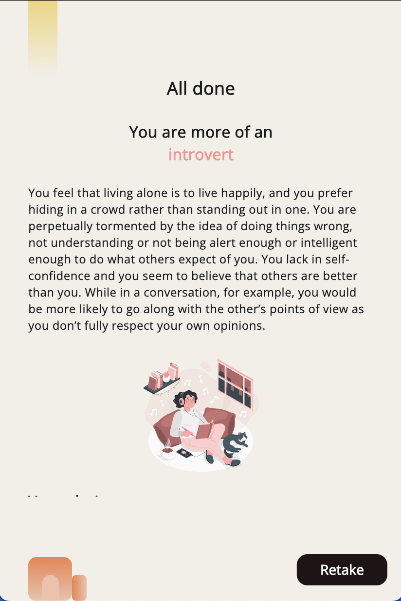
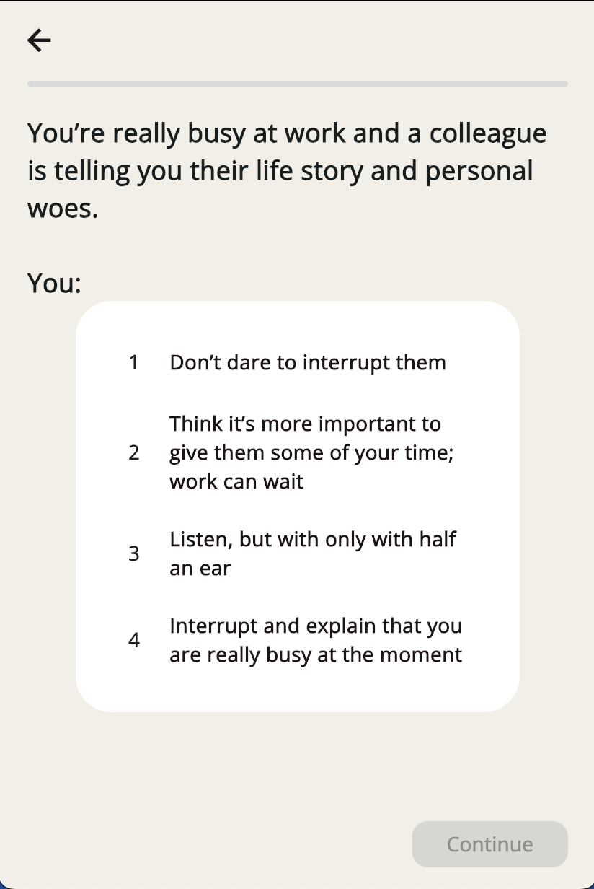
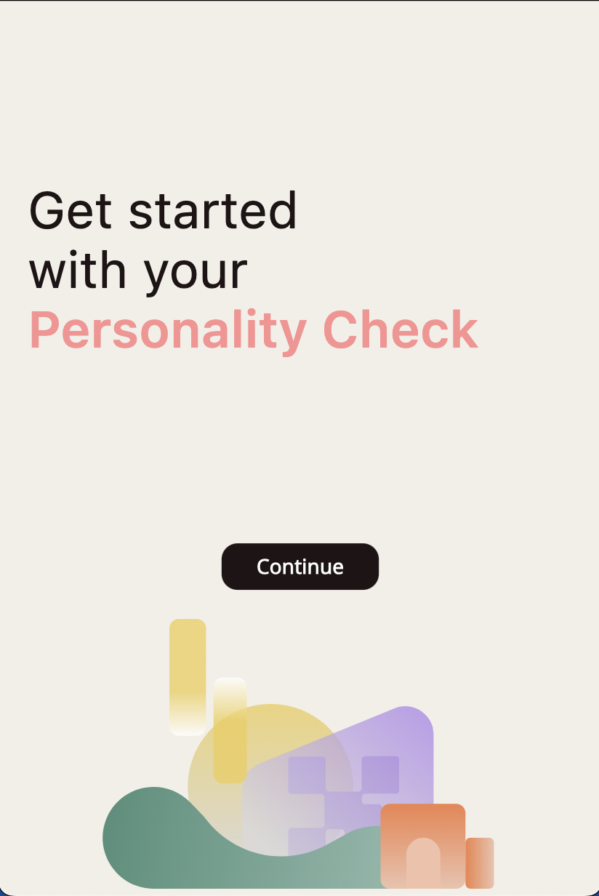

# Personality Checker

User can answer a couple of questions to analyze their personality. This project is a cross-platform Flutter application. It is set up to run on multiple platforms, including Android, iOS, Web, macOS, and Windows.

## Table of Contents
- [Project Setup](#project-setup)
- [Running on Different Platforms](#running-on-different-platforms)
  - [Android](#android)
  - [iOS](#ios)
  - [Web](#web)
  - [macOS](#macos)
  - [Windows](#windows)
- [Running Tests](#running-tests)

---

## Project Setup

Follow these steps to set up the project on your local machine:

1. **Clone the repository**:
   ```bash
   git clone https://github.com/itsDaniyaL/personality_check.git
   cd personality_check
2. **Install Flutter SDK**:
   Make sure you have the Flutter SDK installed. You can find installation instructions for your platform on the official [Flutter website](https://docs.flutter.dev/get-started/install).
3. **Install project dependencies**:
   Once Flutter is installed, you can install the required project dependencies by running:
   ```bash
   flutter pub get
4. Set up platforms:
    * For **iOS**, ensure you have Xcode installed.
    * For **Android**, ensure you have Android Studio with the necessary SDKs.
    * For **Web**, ensure you have Chrome or another supported browser.
    * For **macOS** and **Windows**, ensure your environment is set up for desktop development.

## Running on Different Platforms
### Android
1. Set up an Android emulator or connect a physical device.
2. Run the app:
    ```bash
    flutter run

### iOS
1. Open the iOS simulator or connect a physical iPhone/iPad.
2. Run the app:
    ```bash
    flutter run
    ```
    Ensure you are running on a macOS machine with Xcode installed.

### Web
1. Ensure you have a web browser (like Chrome) installed.
2. Run the app:
    ```bash
    flutter run -d chrome
    ```
    This will launch the app in your default browser.  

### macOS
1. Ensure you're on a macOS machine with desktop support enabled.
2. Run the app:
    ```bash
    flutter run -d macos
    ```

### Windows
1. Ensure you're on a Windows machine with desktop support enabled.
2. Run the app:
    ```bash
    flutter run -d windows
    ``` 

## Running Tests
You can run the unit tests by running following commands:
```bash
flutter test
```
For test converage:
```bash
flutter test --coverage
```

## Additional Notes
* Make sure you have all the necessary platform-specific tools installed (e.g., **Xcode** for iOS, **Android Studio** for Android).
* You may need to run **flutter doctor** to ensure that your environment is properly configured.
* If you encounter issues with dependencies, run **flutter pub get** again and ensure your platform SDKs are up-to-date.

## Screenshots





